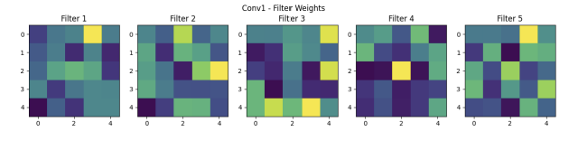
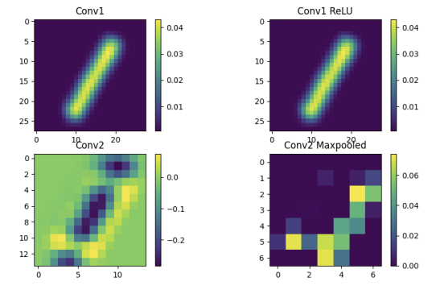
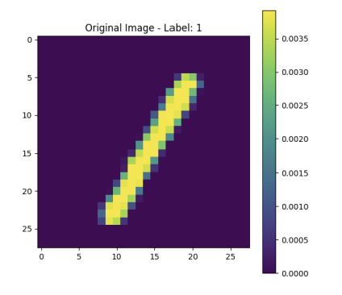
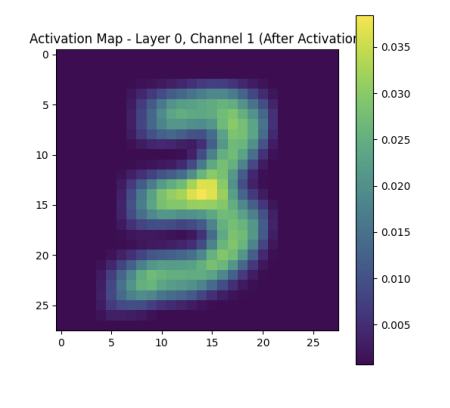

# MNIST Classification with ReLU-based Architectures

This project compares the performance of several neural network architectures based on ReLU activations, for digit classification using the MNIST dataset.

## Implemented Architectures

1. **`first_model()`**

   - A simple baseline model without hidden layers.
   - A single fully connected (FC) layer with 200 neurons using ReLU activation.

2. **`second_model()`**

   - Convolutional architecture:
     - Conv layer: 32 filters, kernel size 5x5
     - MaxPooling: 2x2
     - FC layer: 200 neurons with ReLU

3. **`third_model()`**

   - Same as `second_model()` with an additional FC layer:
     - Conv layer: 32 filters, kernel size 5x5
     - MaxPooling: 2x2
     - FC layers: 200 and 1024 neurons with ReLU

4. **`fourth_model()`**

   - Deep convolutional model:
     - Conv layers: 32 and 64 filters, kernel size 5x5
     - MaxPooling after each conv: 2x2
     - FC layer: 1024 neurons with ReLU

5. **`fifth_model()`**
   - Same as `fourth_model()` with Dropout:
   - Dropout probability: 50%

---

## Filter Visualizations

For the convolutional layer in the architecture with the best balanced accuracy (architecture 5):

- 5 different visualizations of the filter weights:

- 4 convolutional visualizations of each channel before and after the ReLU:

- Original Image:

- Visualizing Feature Maps

An example of a visualization (image) using `conv_image` with the following parameters:

`Mode=5, batch=1, layer_num=0, channel_num=1, after_activation=True`

## Evaluation Summary

### Minibatch Comparison

|                         | **Minibatch = 100** | **Minibatch = 50** |
| ----------------------- | ------------------- | ------------------ |
| **Validation Accuracy** | 99.08%              | 99.02%             |
| **Iterations**          | 19,980              | 29,160             |
| **Training Time**       | 322.81 seconds      | 277.01 seconds     |

---

### Balanced Accuracy Comparison (Architectures 3-5)

| Architecture                   | **Train** | **Validation** | **Test** |
| ------------------------------ | --------- | -------------- | -------- |
| **Architecture 3**             | 0.9418    | 0.9391         | 0.9420   |
| **Architecture 4**             | 0.9562    | 0.9507         | 0.9553   |
| **Architecture 5 - batch=50**  | 0.9966    | 0.9854         | 0.9862   |
| **Architecture 5 - batch=100** | 0.9968    | 0.9872         | 0.9875   |

✅ **Best Performing Model:** Architecture 5 with minibatch size 100.

---

## Required Functions

- **`predict(model, dataset)`**  
  Takes a trained model and dataset, returns predictions and actual labels.

- **`score(predictions, labels)`**  
  Returns success metrics (e.g. accuracy).

- **`conv_image(batch, in_channels, out_channels)`**  
  Applies convolution on a batch of images with given input/output channels.

- **Output File**:  
  `output.txt` should contain:
  - Results of all architectures
  - Score metrics
  - Analysis and comparison of models (including newly added improvements)

---

## Experiment Guidelines

- Evaluate all architectures using two mini-batch sizes:  
  `minibatch = 50`, `minibatch = 100`
- Use validation set to achieve:  
  `accuracy ≈ 0.99`
